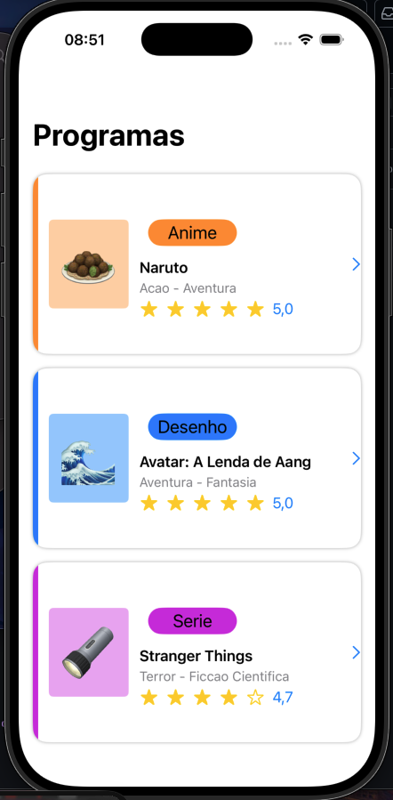
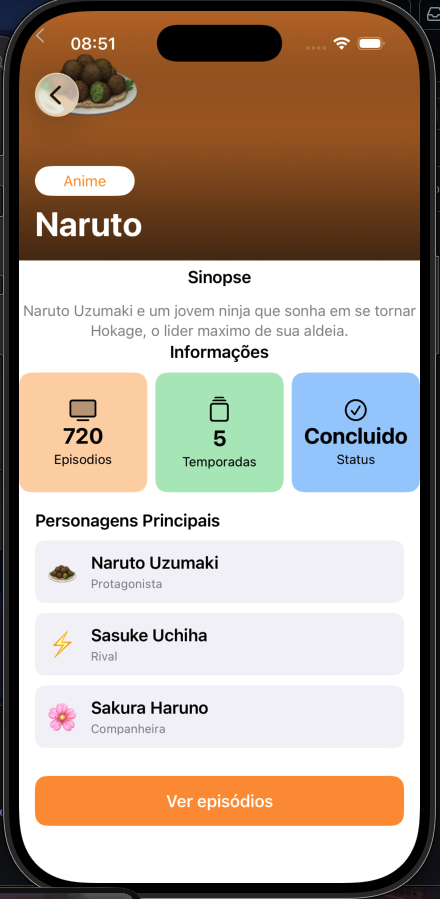

# Atividade Ponderada 2 — Navegação em SwiftUI

## Proposta da Atividade

O objetivo desta atividade foi desenvolver uma aplicação em SwiftUI com foco em navegação entre telas, componentização e organização visual utilizando stacks (`VStack`, `HStack` e `ZStack`).

A proposta consistia em criar uma tela inicial contendo três programas diferentes (Naruto, Avatar e Stranger Things), cada um representado por um card clicável. Ao selecionar um dos cards, o usuário é direcionado para uma tela de detalhes contendo informações do programa, como sinopse, quantidade de episódios, temporadas, status e personagens principais.

Além da implementação base, também foi realizado o desafio bônus da atividade, que consistia em transformar as múltiplas telas de detalhe em uma única view reutilizável, utilizando um modelo dinâmico com `ForEach`.

---

# Desenvolvimento

## 1. Criação da estrutura inicial do projeto

O primeiro passo foi organizar a estrutura do projeto separando os arquivos em componentes, models e views. Foram criados os arquivos necessários para cada parte da aplicação, incluindo:

- `ListaView`
- `ShowCard`
- `InfoBadge`
- `CharacterRow`
- `ProgramaDetailView`
- `Programa.swift`

Essa separação facilitou bastante a reutilização de código e a manutenção do projeto durante o desenvolvimento.

---

## 2. Criação do componente `ShowCard`

Em seguida, foi desenvolvido o componente responsável pelos cards da tela principal.

O `ShowCard` foi construído utilizando principalmente `HStack`, contendo:
- barra lateral colorida;
- emoji do programa;
- badge com o tipo do programa;
- nome;
- gênero;
- avaliação;
- ícone de navegação.

Uma das dificuldades nessa etapa foi organizar corretamente os elementos e ajustar o alinhamento para que os cards ficassem visualmente parecidos com o wireframe fornecido na atividade.

Também foi necessário criar funções auxiliares para definir automaticamente as cores de acordo com o tipo do programa.

---

## 3. Adição dos cards na `ListaView`

Após finalizar o componente dos cards, os programas foram adicionados na tela principal utilizando uma `VStack`.

Inicialmente, os cards foram inseridos manualmente utilizando os objetos fornecidos pelo professor (`naruto`, `avatar` e `strangerThings`).

Posteriormente, durante a implementação do bônus, essa lógica foi substituída por um `ForEach`, permitindo que a lista fosse gerada dinamicamente.

---

## 4. Navegação entre telas com `NavigationLink`

Depois da criação dos cards, foi implementada a navegação entre as telas utilizando `NavigationStack` e `NavigationLink`.

Cada card passou a ser clicável, direcionando o usuário para a tela de detalhes correspondente ao programa selecionado.

Durante essa etapa surgiram alguns erros relacionados ao fechamento correto dos parênteses e ao uso do `NavigationLink`, especialmente na passagem das views como destino. Após ajustes na sintaxe e reorganização da estrutura, a navegação passou a funcionar corretamente.

---

## 5. Desenvolvimento da tela de detalhes e dos `InfoBadges`

Na tela de detalhes foram adicionadas:
- seção hero utilizando `ZStack`;
- gradiente sobreposto;
- emoji do programa;
- badge do tipo;
- nome do programa;
- sinopse;
- informações adicionais;
- lista de personagens principais.

Os `InfoBadges` foram utilizados para exibir:
- episódios;
- temporadas;
- status.

Nessa etapa foi necessário ajustar bastante o layout para evitar sobreposição de elementos e melhorar a organização visual dos componentes.

Também foi criado o componente `CharacterRow`, responsável pela renderização individual de cada personagem.

---

## 6. Implementação do bônus — View reutilizável

Após concluir a versão base, foi implementado o desafio bônus da atividade.

Ao invés de manter três telas separadas para os detalhes dos programas, foi criada uma única view reutilizável chamada `ProgramaDetailView`, que recebe um objeto do tipo `Programa` como parâmetro.

Além disso, foi criado um array contendo todos os programas e utilizado um `ForEach` para gerar os cards dinamicamente na tela inicial.

Essa alteração reduziu bastante a repetição de código e deixou a aplicação mais escalável e organizada.

---

# Conclusão

Ao final da atividade foi possível desenvolver uma aplicação completa em SwiftUI utilizando navegação, componentização e reutilização de views.

Durante o processo foram praticados conceitos importantes como:
- `NavigationStack`
- `NavigationLink`
- `VStack`
- `HStack`
- `ZStack`
- `ForEach`
- componentização
- organização de layout
- reutilização de componentes

Uma das principais dificuldades encontradas foi o ajuste do layout no SwiftUI, especialmente na organização dos elementos dentro do `ZStack` e na criação dos componentes reutilizáveis. Também houve alguns erros de sintaxe relacionados à navegação e ao fechamento correto das estruturas.

Apesar disso, a atividade permitiu consolidar o entendimento sobre a construção de interfaces no SwiftUI e sobre a importância da componentização para evitar repetição de código.

## Resultado Final

### Tela de Cards

### Tela de Infos

